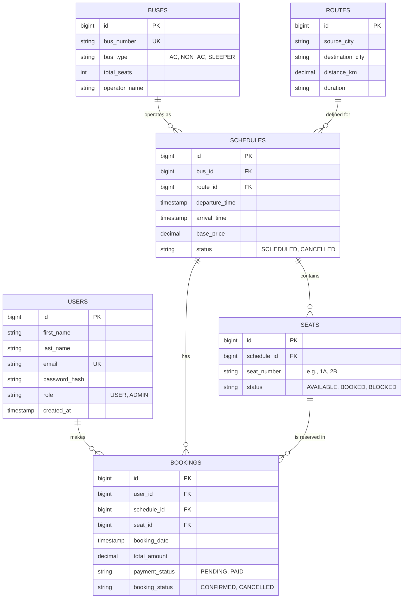

# Bus Booking Application - Database Design

This document provides a detailed specification for the relational database schema, ensuring data integrity, performance, and scalability.

## 1. Entity-Relationship Diagram (ERD)

---

## 2. Detailed Table Specifications

### Table: `users`
| Column | Type | Constraints | Description |
| :--- | :--- | :--- | :--- |
| `id` | BIGINT | PRIMARY KEY, AUTO_INCREMENT | Unique identifier for the user. |
| `first_name` | VARCHAR(50) | NOT NULL | User's first name. |
| `last_name` | VARCHAR(50) | NOT NULL | User's last name. |
| `email` | VARCHAR(100) | UNIQUE, NOT NULL | Used for login and notifications. |
| `password` | VARCHAR(255) | NOT NULL | BCrypt hashed password. |
| `role` | ENUM | 'USER', 'ADMIN' | Access control level. |
| `created_at` | TIMESTAMP | DEFAULT CURRENT_TIMESTAMP | Record creation time. |

### Table: `buses`
| Column | Type | Constraints | Description |
| :--- | :--- | :--- | :--- |
| `id` | BIGINT | PRIMARY KEY, AUTO_INCREMENT | Unique identifier for the bus. |
| `bus_number`| VARCHAR(20) | UNIQUE, NOT NULL | Vehicle registration number. |
| `bus_type` | ENUM | 'AC', 'NON_AC', 'SLEEPER' | Classification of the bus. |
| `total_seats`| INT | NOT NULL | Total capacity. |
| `operator`  | VARCHAR(100) | NOT NULL | Name of the bus company. |

### Table: `routes`
| Column | Type | Constraints | Description |
| :--- | :--- | :--- | :--- |
| `id` | BIGINT | PRIMARY KEY, AUTO_INCREMENT | Unique identifier for the route. |
| `source` | VARCHAR(100) | NOT NULL | Starting city. |
| `destination`| VARCHAR(100) | NOT NULL | Ending city. |
| `distance` | DECIMAL(10,2)| NOT NULL | Distance in kilometers. |

### Table: `schedules`
| Column | Type | Constraints | Description |
| :--- | :--- | :--- | :--- |
| `id` | BIGINT | PRIMARY KEY, AUTO_INCREMENT | Unique trip identifier. |
| `bus_id` | BIGINT | FOREIGN KEY (buses.id) | Assigned vehicle. |
| `route_id` | BIGINT | FOREIGN KEY (routes.id) | Assigned path. |
| `departure` | TIMESTAMP | NOT NULL | Planned departure time. |
| `arrival` | TIMESTAMP | NOT NULL | Planned arrival time. |
| `base_price` | DECIMAL(10,2)| NOT NULL | Cost per seat. |

### Table: `seats`
*Note: One record per seat per schedule to manage real-time availability.*
| Column | Type | Constraints | Description |
| :--- | :--- | :--- | :--- |
| `id` | BIGINT | PRIMARY KEY, AUTO_INCREMENT | |
| `schedule_id`| BIGINT | FOREIGN KEY (schedules.id) | |
| `seat_no` | VARCHAR(10) | NOT NULL | Label (e.g., '1A'). |
| `is_booked` | BOOLEAN | DEFAULT FALSE | Status flag. |

### Table: `bookings`
| Column | Type | Constraints | Description |
| :--- | :--- | :--- | :--- |
| `id` | BIGINT | PRIMARY KEY, AUTO_INCREMENT | |
| `user_id` | BIGINT | FOREIGN KEY (users.id) | |
| `schedule_id`| BIGINT | FOREIGN KEY (schedules.id) | |
| `seat_id` | BIGINT | FOREIGN KEY (seats.id) | |
| `booked_at` | TIMESTAMP | DEFAULT CURRENT_TIMESTAMP | |
| `total_paid` | DECIMAL(10,2)| NOT NULL | Final price. |

---

## 3. Data Integrity & Indices
- **Composite Index on `schedules`**: `(route_id, departure)` to speed up bus searches.
- **Unique Constraint on `seats`**: `(schedule_id, seat_no)` to prevent duplicate seat assignments.
- **Foreign Keys**: Cascading deletes for `seats` when a `schedule` is removed.
