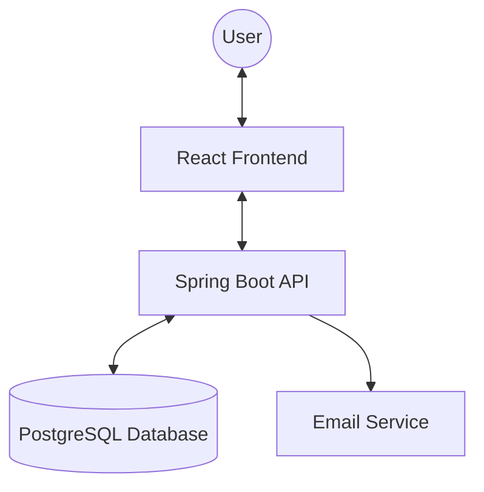

# Bus Booking Application - Detailed Design Specification

Based on the project requirements, here is the comprehensive design for the application.

## 1. Database Schema (ERD)

The database follows a relational structure optimized for performance and integrity.

| Table | Columns | Description |
| :--- | :--- | :--- |
| **Users** | `id` (PK), `name`, `email`, `password`, `role` | Stores user profiles and auth details. |
| **Buses** | `id` (PK), `bus_number`, `type` (AC/Sleeper), `capacity` | Details of the fleet. |
| **Routes** | `id` (PK), `source`, `destination`, `distance` | Geographic paths. |
| **Schedules** | `id` (PK), `bus_id` (FK), `route_id` (FK), `departure`, `arrival`, `price` | Timing and pricing for a trip. |
| **Seats** | `id` (PK), `schedule_id` (FK), `seat_number`, `is_booked` | Dynamic availability per trip. |
| **Bookings** | `id` (PK), `user_id` (FK), `schedule_id` (FK), `seat_id` (FK), `date` | Transactional data. |

---

## 2. API Design (RESTful)

### Authentication
- `POST /api/auth/register`: Create a new user account.
- `POST /api/auth/login`: Authenticate and receive a JWT.

### Bus Search & Details
- `GET /api/buses/search?from=...&to=...&date=...`: Fetch available buses.
- `GET /api/buses/{id}/seats`: Get seat layout and availability for a specific schedule.

### Booking Management
- `POST /api/bookings`: Reserve a seat.
- `GET /api/bookings/my`: List current user's bookings.
- `DELETE /api/bookings/{id}`: Cancel a booking.

---

## 3. UI Flow & Components

### A. Landing Page
- **Hero Section**: Modern search bar with glassmorphism effect.
- **Features**: Showing why to choose this service (Secure, Fast, Easy).

### B. Search Results
- **Filters**: Filter by Time, Price, Bus Type.
- **Bus Cards**: Summary of departure, arrival, and "Select Seat" button.

### C. Seat Selection
- **Interactive Grid**: Visual representation of the bus layout.
- **Legend**: Color-coded (Selected, Available, Occupied).

### D. Confirmation & Payment
- **User Info Form**: Auto-filled for logged-in users.
- **Ticket Preview**: Real-time summary before final booking.

---

## 4. Technical Architecture



## 5. Security & Exception Handling
- **JWT**: Stateless authentication via `Authorization` header.
- **CORS**: Configured to allow requests from the React frontend.
- **Global Handler**: Standardized JSON error response:
  ```json
  {
    "status": 404,
    "message": "Bus not found",
    "timestamp": "2026-04-10T..."
  }
  ```
