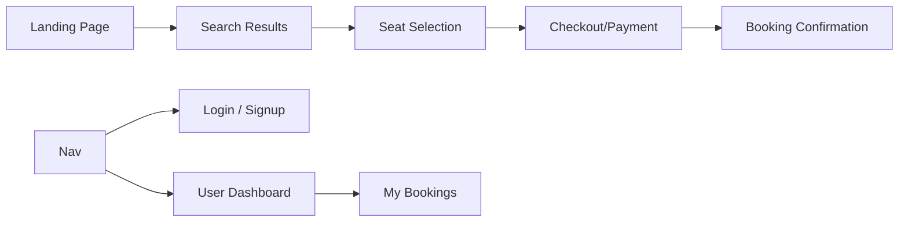

# Bus Booking Application - UI Design Specification

This document details the user interface pages and components required for a premium, high-converting booking experience.

## 1. Page Map & Navigation Flow

---

## 2. Detailed Page Breakdown

### A. Landing Page (The Entryway)
*   **Hero Section**: A high-impact background (abstract travel gradients) with a "Glassmorphism" search card.
    *   **Fields**: `Source City`, `Destination City`, `Travel Date`.
*   **Quick Links**: Top-rated routes (e.g., "Mumbai to Goa") with "Book Now" buttons.
*   **Features Section**: Dynamic icons highlighting benefits (e.g., "Verified Operators", "24/7 Support").

### B. Search Results Page (Comparison)
*   **Filter Sidebar**:
    *   **Bus Types**: AC, Non-AC, Sleeper, Seater.
    *   **Departure Time**: Early Morning, Mid Day, Evening, Night.
    *   **Price Range**: Interactive slider.
*   **Bus Listing Table/Cards**:
    *   **Operator Info**: Logo, Name, and Star Rating.
    *   **Trip Details**: Pick-up time/point, Drop-off time/point, Duration.
    *   **Pricing**: Bold price display with discount tags (if any).
    *   **Action**: "View Seats" button (Secondary color to pop).

### C. Seat Selection Page (Interactive Grid)
*   **Bus Layout**: A visual grid representing the bus interior.
    *   **Lower/Upper Decks**: Tabs to toggle between floors if it's a sleeper.
    *   **Seat Legend**:
        *   🟢 **Available**
        *   ⚪ **Occupied**
        *   🔵 **Selected**
        *   🏩 **Women Only** (Safety feature)
*   **Selection Summary**: A sticky sidebar showing selected seat numbers and total fare.

### D. Booking & Checkout Page (Finalizing)
*   **Passenger Details**: Form with fields for `Name`, `Age`, `Gender`. 
*   **Contact Info**: `Mobile Number` (for SMS ticket) and `Email`.
*   **Fare Breakdown**: Detailed view of Base Fare, Service Fee, and GST.
*   **Payment**: Modern radio-button list for "UPI", "Credit/Debit Card", "Net Banking".

### E. User Dashboard & My Bookings (Management)
*   **Upcoming Trips**: Prominent cards with "Print Ticket" and "Cancel Trip" options.
*   **Past Trips**: Grayed-out history for reference.
*   **Profile Settings**: Manage name, email, and password.

---

## 3. Design Aesthetics & Micro-interactions

*   **Colors**: A palette of **Deep Navy (#1A2B48)** for trust, **Vibrant Orange/Coral (#FF6B6B)** for call-to-actions, and **Soft Grays** for backgrounds.
*   **Typography**: Clean, sans-serif fonts (e.g., **Inter** or **Roboto**) for maximum readability.
*   **Animations**:
    *   **Hover States**: Subtle scale-up effect on bus listing cards.
    *   **Transitions**: Fade-in transitions when navigating between search and booking steps.
    *   **Loading States**: Shimmer/Skeleton screens while fetching buses.

---

## 4. Responsive Design Strategy
*   **Mobile First**: The search and seat selection will be optimized for thumb-friendly interaction on smartphones.
*   **Desktop**: Expanded view for filters and side-by-side comparison of multiple bus options.
